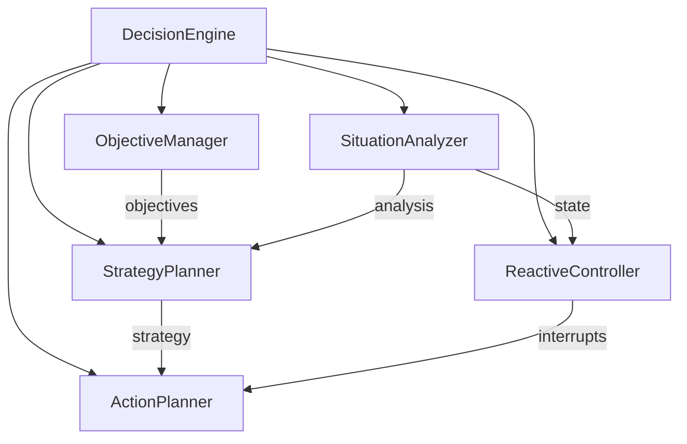

# Decision Components

The decision system is responsible for strategic planning, tactical decision making, and reactive responses in the game AI. It uses a layered approach to handle different time scales and types of decisions.

## Architecture

```
decision/
├── objective_manager.py    # Goal management
├── strategy_planner.py     # Strategic planning
├── situation_analyzer.py   # State analysis
├── action_planner.py       # Action generation
├── reactive_controller.py  # Immediate responses
└── __init__.py            # Component exports
```

## Components

### ObjectiveManager
- **Purpose**: Manage and prioritize AI goals and objectives
- **Key Features**:
  - Objective creation and validation
  - Priority management
  - Objective tracking
  - Goal decomposition
- **Usage**: Define and manage AI goals

### StrategyPlanner
- **Purpose**: Develop long-term strategic plans
- **Key Features**:
  - Strategy generation
  - Resource allocation
  - Plan adaptation
  - LLM integration
- **Usage**: Create high-level game strategies

### SituationAnalyzer
- **Purpose**: Analyze current game state and context
- **Key Features**:
  - State evaluation
  - Threat assessment
  - Opportunity detection
  - Risk analysis
- **Usage**: Understand current game situation

### ActionPlanner
- **Purpose**: Convert strategies into concrete actions
- **Key Features**:
  - Action sequence generation
  - Action validation
  - Constraint handling
  - Action optimization
- **Usage**: Generate executable action sequences

### ReactiveController
- **Purpose**: Handle immediate responses to game events
- **Key Features**:
  - Quick response generation
  - Threat reaction
  - Opportunity exploitation
  - Action interruption
- **Usage**: Provide immediate tactical responses

## Component Relationships



## Decision Flow

1. Game state received from vision/memory systems
2. SituationAnalyzer evaluates current state
3. ReactiveController checks for immediate responses
4. If no immediate response needed:
   - ObjectiveManager prioritizes goals
   - StrategyPlanner develops strategy
   - ActionPlanner generates action sequence
5. Actions are sent to action system

## Configuration

Decision components are configured through a shared configuration object:

```python
{
    'objectives': {
        'max_objectives': 10,     # Maximum concurrent objectives
        'min_priority': 0.0,      # Minimum objective priority
        'max_priority': 1.0      # Maximum objective priority
    },
    'strategy': {
        'planning_horizon': 60,   # Planning horizon in seconds
        'max_strategies': 5,      # Maximum alternative strategies
        'adaptation_rate': 0.5   # Strategy adaptation rate
    },
    'situation': {
        'analysis_interval': 0.1, # Analysis interval in seconds
        'threat_threshold': 0.7,  # Threat detection threshold
        'opportunity_threshold': 0.3 # Opportunity detection threshold
    },
    'action': {
        'max_sequence_length': 20, # Maximum actions in sequence
        'min_duration': 0.1,      # Minimum action duration
        'max_duration': 5.0      # Maximum action duration
    },
    'reactive': {
        'response_time': 0.05,    # Maximum response time
        'cooldown': 0.5,         # Minimum time between reactions
        'interrupt_threshold': 0.8 # Action interrupt threshold
    }
}
```

## Usage Example

```python
# Initialize components
decision_engine = DecisionEngine(config_path)

# Process game state
game_state = {
    'player': {'health': 100, 'position': (0, 0, 0)},
    'enemies': [{'type': 'zombie', 'distance': 10}],
    'resources': [{'type': 'wood', 'amount': 5}]
}

# Get situation analysis
analysis = decision_engine.evaluate_situation(game_state)

# Check for reactive response
reaction = decision_engine.reactive_response(game_state)
if reaction:
    print(f"Immediate reaction: {reaction['type']}")
else:
    # Generate strategic plan
    strategy = decision_engine.strategic_planning(game_state, memory)
    
    # Generate action sequence
    actions = decision_engine.tactical_planning(strategy, game_state)
    
    print(f"Planned actions: {len(actions)}")
```

## Extension Points

Each component provides extension points for adding new functionality:

- **ObjectiveManager**: Add new objective types
- **StrategyPlanner**: Add new strategy templates
- **SituationAnalyzer**: Add new analysis methods
- **ActionPlanner**: Add new action types
- **ReactiveController**: Add new response patterns

## Best Practices

1. Prioritize reactive responses for immediate threats
2. Balance strategic and tactical planning
3. Keep action sequences manageable
4. Update situation analysis frequently
5. Cache analysis results when appropriate
6. Handle planning failures gracefully
7. Monitor decision timing
8. Validate actions before execution
9. Use appropriate time horizons
10. Consider resource constraints

## Integration

The decision system integrates with other systems through:

1. **Vision System**:
   - Receives visual input
   - Processes object detection
   - Analyzes scene structure

2. **Memory System**:
   - Accesses historical data
   - Stores decisions and outcomes
   - Tracks objective progress

3. **Action System**:
   - Sends action commands
   - Receives action feedback
   - Validates action execution

## Performance Considerations

1. Strategic planning can be computationally intensive
2. Reactive responses need to be fast
3. Cache frequently used analyses
4. Use appropriate update intervals
5. Limit planning horizon
6. Optimize objective priorities
7. Balance decision quality vs. speed
8. Monitor memory usage
9. Profile decision timing
10. Consider parallel processing

## LLM Integration

The decision system can integrate with Language Learning Models (LLM) through:

1. **Strategy Generation**:
   - Generate creative strategies
   - Adapt to novel situations
   - Learn from experience

2. **Situation Analysis**:
   - Interpret complex scenarios
   - Identify patterns
   - Suggest approaches

3. **Action Planning**:
   - Generate action sequences
   - Optimize combinations
   - Handle edge cases

Configure LLM integration through:
```python
{
    'llm': {
        'enabled': True,
        'model': 'llama2',
        'temperature': 0.7,
        'max_tokens': 100,
        'timeout': 1.0
    }
}
