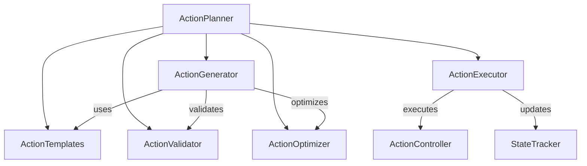

# Action System Components

The action system is responsible for generating, validating, optimizing, and executing game actions. It uses a component-based architecture to handle different aspects of action management.

## Architecture

```
actions/
├── action_executor.py    # Action execution and lifecycle
├── action_generator.py   # Action sequence generation
├── action_templates.py   # Action pattern management
├── action_validator.py   # Action validation
├── action_optimizer.py   # Sequence optimization
└── __init__.py          # Component exports
```

## Components

### ActionExecutor
- **Purpose**: Handle action execution and lifecycle management
- **Key Features**:
  - Action state tracking
  - Execution validation
  - Lifecycle management
  - Input simulation
- **Usage**: Execute and monitor actions

### ActionGenerator
- **Purpose**: Generate action sequences from goals
- **Key Features**:
  - Template-based generation
  - Dynamic customization
  - State-aware generation
  - Fallback handling
- **Usage**: Create executable action sequences

### ActionTemplates
- **Purpose**: Manage predefined action patterns
- **Key Features**:
  - Pattern organization
  - Template customization
  - Category management
  - Pattern validation
- **Usage**: Define reusable action patterns

### ActionValidator
- **Purpose**: Validate actions against constraints
- **Key Features**:
  - State validation
  - Constraint checking
  - Requirement verification
  - Cooldown management
- **Usage**: Ensure action validity

### ActionOptimizer
- **Purpose**: Optimize action sequences
- **Key Features**:
  - Redundancy removal
  - Sequence merging
  - Duration optimization
  - Pattern recognition
- **Usage**: Improve action efficiency

## Component Relationships



## Configuration

Action components are configured through a shared configuration object:

```python
{
    'action': {
        'max_sequence_length': 20,  # Maximum actions in sequence
        'min_duration': 0.1,       # Minimum action duration
        'max_duration': 5.0,       # Maximum action duration
        'default_duration': 0.5    # Default action duration
    },
    'templates': {
        'categories': ['movement', 'combat', 'resource', 'interaction'],
        'max_template_size': 10    # Maximum actions per template
    },
    'validation': {
        'cooldown': 0.1,          # Action cooldown period
        'timeout': 5.0            # Action timeout period
    },
    'optimization': {
        'merge_threshold': 0.1,    # Similar action merge threshold
        'min_sequence_length': 1   # Minimum sequence length
    }
}
```

## Usage Example

```python
# Initialize components
action_system = create_action_system(config)

# Generate actions from strategy
strategy = {
    'objectives': [{
        'type': 'exploration',
        'goal': 'explore',
        'target': {'x': 100, 'y': 100}
    }]
}

game_state = {
    'player': {'position': {'x': 0, 'y': 0}},
    'environment': {'visibility': 1.0}
}

constraints = {
    'movement_constraints': {
        'speed': 100,
        'terrain': 'normal'
    }
}

# Plan and execute actions
actions = action_system['generator'].generate_actions(
    strategy['objectives'][0],
    game_state
)

# Validate actions
valid_actions = [
    action for action in actions
    if action_system['validator'].validate_action(action, game_state)
]

# Optimize sequence
optimized = action_system['optimizer'].optimize_sequence(
    valid_actions,
    game_state,
    constraints
)

# Execute actions
if action_system['executor']:
    for action in optimized:
        action_system['executor'].execute_action(action)
```

## Extension Points

Each component provides extension points for adding new functionality:

- **ActionExecutor**: Add new execution handlers
- **ActionGenerator**: Add new generation strategies
- **ActionTemplates**: Add new template categories
- **ActionValidator**: Add new validation rules
- **ActionOptimizer**: Add new optimization methods

## Best Practices

1. Use templates for common action patterns
2. Validate actions before execution
3. Optimize sequences for efficiency
4. Handle execution failures gracefully
5. Monitor action states
6. Cache templates when appropriate
7. Use proper error handling
8. Maintain action timeouts
9. Consider state constraints
10. Document custom patterns

## Integration

The action system integrates with other systems through:

1. **Vision System**:
   - Validates action results
   - Provides feedback
   - Guides targeting

2. **Memory System**:
   - Tracks action history
   - Stores templates
   - Maintains state

3. **Decision System**:
   - Provides strategies
   - Sets objectives
   - Handles planning

## Performance Considerations

1. Template lookup should be fast
2. Validation should be lightweight
3. Optimize common patterns
4. Cache validation results
5. Batch similar actions
6. Monitor execution timing
7. Handle timeouts properly
8. Use appropriate sequence lengths
9. Profile critical paths
10. Consider memory usage

## Error Handling

1. **Validation Failures**:
   - Log validation errors
   - Use fallback actions
   - Notify decision system

2. **Execution Failures**:
   - Retry with backoff
   - Use alternative actions
   - Update state properly

3. **Optimization Issues**:
   - Maintain minimum sequence
   - Preserve critical actions
   - Log optimization failures

4. **Template Errors**:
   - Validate templates
   - Use default patterns
   - Log template issues

## Testing

The action system includes comprehensive tests:

1. **Unit Tests**:
   - Component functionality
   - Error handling
   - Edge cases

2. **Integration Tests**:
   - Component interaction
   - System integration
   - End-to-end flows

3. **Performance Tests**:
   - Sequence generation
   - Template lookup
   - Optimization speed
