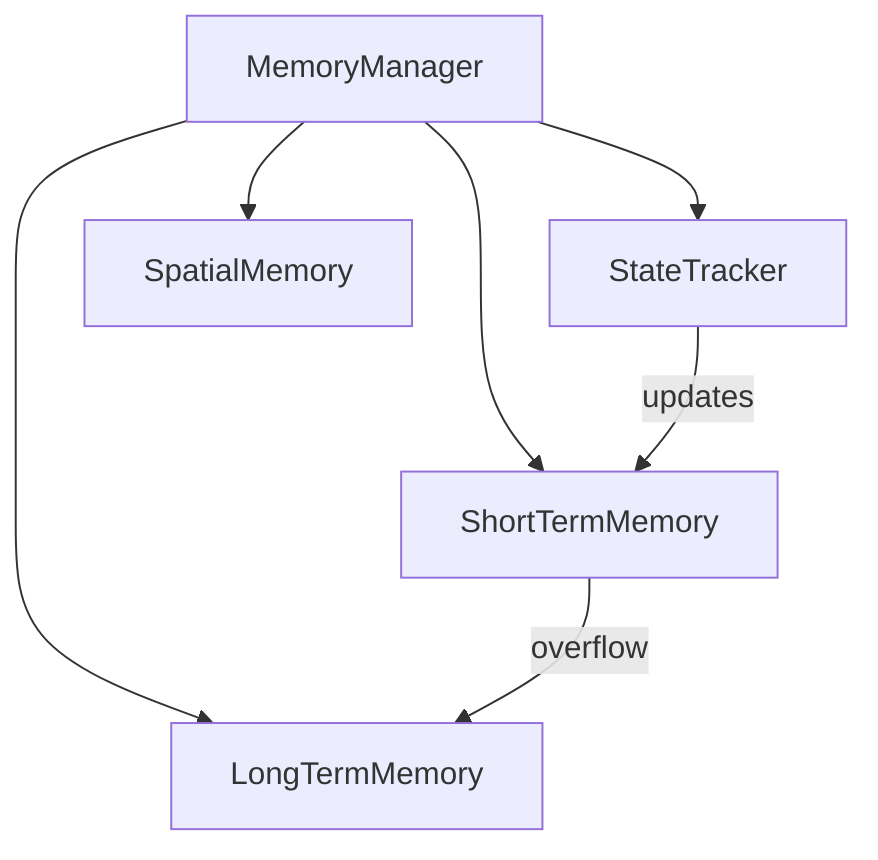

# Memory Components

The memory system is responsible for storing, managing, and retrieving game state information across different time scales and contexts. It uses a multi-layered approach to handle different types of memory.

## Architecture

```
memory/
├── state_tracker.py      # Current state management
├── short_term_memory.py  # Recent memory storage
├── long_term_memory.py   # Persistent memory storage
├── spatial_memory.py     # World state and navigation
└── __init__.py          # Component exports
```

## Components

### StateTracker
- **Purpose**: Manages current game state and immediate history
- **Key Features**:
  - State change detection and notification
  - State history tracking
  - Callback system for state changes
  - Automatic persistence of state
- **Usage**: Primary interface for state updates and access

### ShortTermMemory
- **Purpose**: Manages recent events and states
- **Key Features**:
  - Fixed-size circular buffers for states and events
  - Type-based indexing for quick access
  - Overflow handling with callbacks
  - Memory statistics and monitoring
- **Usage**: Store and retrieve recent game events and states

### LongTermMemory
- **Purpose**: Persistent storage of historical data
- **Key Features**:
  - Date-based organization
  - Automatic compression of old data
  - Storage limit management
  - Efficient querying and retrieval
- **Usage**: Archive and retrieve historical game data

### SpatialMemory
- **Purpose**: World state and navigation management
- **Key Features**:
  - Chunk-based world representation
  - Points of interest tracking
  - Path history and exploration tracking
  - Block state caching
- **Usage**: Manage spatial data and navigation information

## Component Relationships



## Data Flow

1. New state arrives at MemoryManager
2. StateTracker processes and tracks changes
3. State is stored in ShortTermMemory
4. When ShortTermMemory fills up, oldest items move to LongTermMemory
5. Spatial data is extracted and managed by SpatialMemory
6. All components persist their data independently

## Configuration

Memory components are configured through a shared configuration object that includes:

```python
{
    'short_term_limit': 100,      # Max items in short-term memory
    'long_term_limit': 1000,      # Max files in long-term storage
    'cleanup_interval': 3600,     # Cleanup interval in seconds
    'chunk_size': 16,            # Spatial memory chunk size
    'max_path_history': 1000,    # Max path history points
    'compression_age_days': 30,   # Age for compressing old data
    'cleanup_threshold_mb': 1000, # Storage limit in MB
    'save_state_history': True   # Whether to save state history
}
```

## Usage Example

```python
# Initialize components
memory_manager = MemoryManager(config_path)

# Update state
memory_manager.update_current_state({
    'player': {'health': 100, 'position': (0, 0, 0)},
    'inventory': {'items': []},
    'environment': {'blocks': []}
})

# Store event
memory_manager.store_event('player_damage', {
    'amount': 10,
    'source': 'enemy'
})

# Query memory
memories = memory_manager.get_relevant_memory({
    'type': 'player_damage',
    'limit': 10
})

# Add point of interest
memory_manager.add_point_of_interest(
    'home_base',
    x=100, y=64, z=100,
    poi_type='base'
)
```

## Extension Points

Each component provides extension points for adding new functionality:

- **StateTracker**: Add new state change callbacks
- **ShortTermMemory**: Add new memory type indexing
- **LongTermMemory**: Add new compression strategies
- **SpatialMemory**: Add new spatial analysis methods

## Best Practices

1. Always use MemoryManager as the primary interface
2. Register callbacks for important state changes
3. Use appropriate memory type for data lifetime
4. Configure limits based on available resources
5. Regularly clean up old data
6. Use spatial memory for navigation-related tasks
7. Monitor memory statistics for performance
