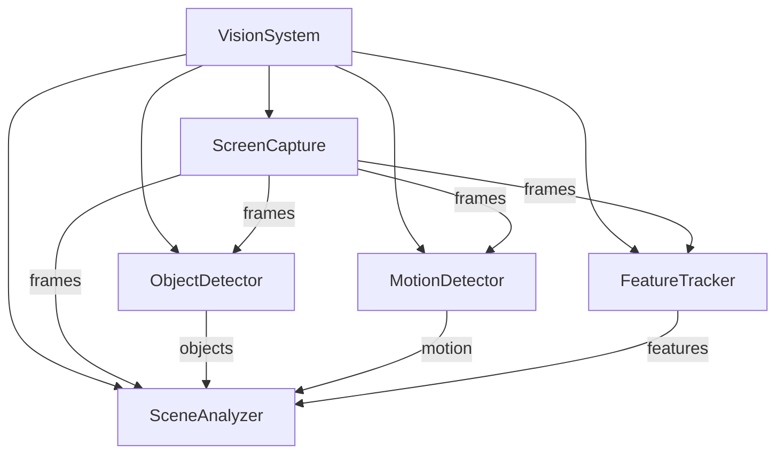

# Vision Components

The vision system is responsible for capturing, processing, and analyzing visual input from the game. It uses a pipeline architecture to transform raw screen captures into meaningful game state information.

## Architecture

```
vision/
├── screen_capture.py     # Window/monitor capture
├── object_detector.py    # Color-based object detection
├── motion_detector.py    # Motion tracking
├── feature_tracker.py    # SIFT feature detection
├── scene_analyzer.py     # Scene structure analysis
└── __init__.py          # Component exports
```

## Components

### ScreenCapture
- **Purpose**: Capture frames from game window or monitor
- **Key Features**:
  - Window-based capture
  - Monitor-based capture
  - Resolution management
  - Frame rate control
- **Usage**: Primary source of visual input

### ObjectDetector
- **Purpose**: Detect and classify game objects using color patterns
- **Key Features**:
  - Color range definitions
  - Contour detection
  - Object classification
  - Position tracking
- **Usage**: Identify game objects and their locations

### MotionDetector
- **Purpose**: Track movement and changes between frames
- **Key Features**:
  - Frame differencing
  - Motion region detection
  - Movement pattern analysis
  - Change magnitude calculation
- **Usage**: Detect dynamic changes in the game environment

### FeatureTracker
- **Purpose**: Track distinctive visual features across frames
- **Key Features**:
  - SIFT feature detection
  - Feature matching
  - Feature tracking
  - Transformation estimation
- **Usage**: Track stable visual features for navigation

### SceneAnalyzer
- **Purpose**: Analyze overall scene structure and composition
- **Key Features**:
  - Edge detection
  - Line detection
  - Region analysis
  - Scene segmentation
- **Usage**: Understand scene layout and structure

## Component Relationships



## Data Flow

1. ScreenCapture obtains raw frame
2. Frame is processed in parallel by:
   - ObjectDetector for object recognition
   - MotionDetector for movement tracking
   - FeatureTracker for feature detection
3. SceneAnalyzer combines all inputs for scene understanding
4. Results are aggregated into frame analysis
5. Analysis is provided to decision system

## Configuration

Vision components are configured through a shared configuration object:

```python
{
    'capture': {
        'fps': 30,                # Target frame rate
        'resolution': (1920, 1080) # Capture resolution
    },
    'detection': {
        'color_ranges': {         # Object color definitions
            'player': [(0, 100, 100), (10, 255, 255)],
            'enemy': [(0, 0, 100), (180, 30, 255)]
        },
        'min_object_size': 100,   # Minimum object size in pixels
        'max_object_size': 10000  # Maximum object size in pixels
    },
    'motion': {
        'threshold': 25,          # Motion detection threshold
        'history': 20            # Motion history length
    },
    'features': {
        'max_features': 1000,     # Maximum features to track
        'quality_level': 0.3,     # Feature quality threshold
        'min_distance': 7        # Minimum feature distance
    },
    'scene': {
        'edge_threshold': 100,    # Edge detection threshold
        'line_threshold': 50,     # Line detection threshold
        'region_size': 3         # Analysis region grid size
    }
}
```

## Usage Example

```python
# Initialize components
vision_system = VisionSystem(config_path)

# Process single frame
frame_analysis = vision_system.process_frame()

# Get object locations
objects = frame_analysis['objects']
for obj in objects:
    print(f"Found {obj['type']} at {obj['position']}")

# Get motion information
motion = frame_analysis['motion']
print(f"Motion magnitude: {motion['magnitude']}")

# Get scene structure
structure = frame_analysis['structure']
print(f"Scene regions: {len(structure['regions'])}")

# Get tracked features
features = frame_analysis['features']
print(f"Tracking {len(features['keypoints'])} features")
```

## Extension Points

Each component provides extension points for adding new functionality:

- **ScreenCapture**: Add new capture methods
- **ObjectDetector**: Add new object types and detection methods
- **MotionDetector**: Add new motion analysis algorithms
- **FeatureTracker**: Add new feature types and tracking methods
- **SceneAnalyzer**: Add new scene analysis techniques

## Best Practices

1. Configure frame rate based on game requirements
2. Calibrate color ranges for reliable detection
3. Adjust motion sensitivity to game speed
4. Balance feature count with performance
5. Use appropriate region sizes for scene analysis
6. Monitor performance metrics
7. Handle capture failures gracefully
8. Process frames sequentially
9. Cache results when appropriate
10. Clean up resources properly

## Performance Considerations

1. Frame capture is typically the bottleneck
2. Feature detection can be CPU intensive
3. Consider downscaling for faster processing
4. Use motion detection to trigger detailed analysis
5. Cache feature detection results
6. Limit analysis region size
7. Use appropriate thresholds
8. Monitor memory usage
9. Profile performance regularly
10. Consider GPU acceleration for feature detection

## Integration

The vision system integrates with other systems through:

1. **Memory System**:
   - Stores processed frame data
   - Caches detection results
   - Tracks object history

2. **Decision System**:
   - Provides input for decision making
   - Informs tactical planning
   - Triggers reactive responses

3. **Action System**:
   - Guides action targeting
   - Provides feedback for actions
   - Validates action results
